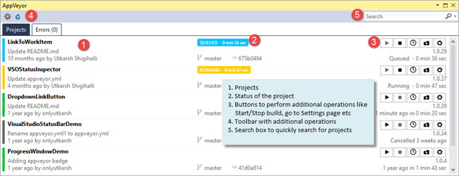

# Introduction #

[AppVeyor](http://www.appveyor.com/) is a well known cloud build server, which integrates with many source controls like VSO (Visual Studio Online), GitHub, BitBucket etc. Like many others do, we love Appveyor. However, most of the time we spend our time in Visual Studio and interacting with Appveyor was not possible from within Visual Studio. So we decided to build an extension!

> [**Download**](https://marketplace.visualstudio.com/items?itemName=UtkarshShigihalliandTarunArora.AppVeyorExtensionforVisualStudio) from VS Marketplace.
> 

## Note ##

- The extension is developed in Visual Studio 2013 using [VS2013 SDK](https://www.microsoft.com/en-gb/download/details.aspx?id=40758).
- We use [PostSharp](https://www.postsharp.net) to handle exceptions in our extension. If you do not have license, please remove `[HandleException]` attribute from the methods.

## Defects/ Issues? ##
Please [raise a issue](https://github.com/onlyutkarsh/AppVeyorExtension/issues/new) and we will try our best to address and fix the issue.
Alternatively you can **contribute** the fix send the pull request :-)
